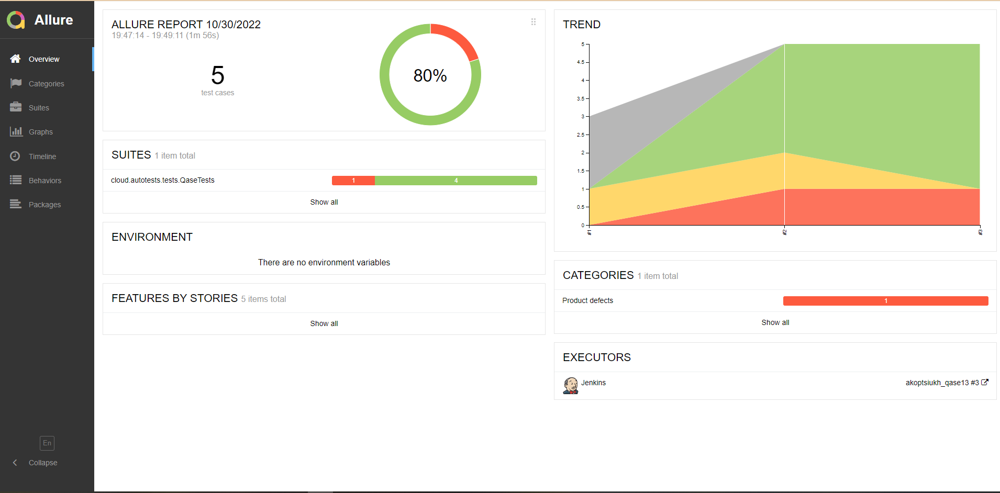

# Automation project for qase.io

# <a name="Content">Content:</a>
+ [Technology stack](#Technology stack)
+ [Test cases](#Test cases)
+ [Running tests using terminal](#Running tests using terminal)
+ [Deployment in Jenkins](#Deployment in Jenkins)
+ [Allure Report](#Allure Report)
+ [Telegram Notification](#Telegram Notification)
+ [Tests execution video](#Tests execution video)

# <a name="Technology stack">Technology stack</a>

<p align="center">


</p>

# <a name="Test cases">Test cases</a>

> TC1 - Page title should have header text
>
> TC2 - Unauthorized user can navigate to login page from main page
>
> TC3 - Unauthorized user can navigate to price page from main page  
>
> TC4 - Unauthorized user can navigate to blog page from main page
> 
> TC5 - Unauthorized user can navigate to documentation page from main page
>


# <a name="Running tests using terminal">Running tests using terminal</a>

```bash
gradle clean test
```

# <a name="Deployment in Jenkins">Deployment in Jenkins</a>

```bash
clean
test
-Dbrowser=${BROWSER}
-DbrowserVersion=${BROWSER_VERSION}
-DbrowserSize=${BROWSER_SIZE}
-DremoteDriverUrl=https://user1:1234@${REMOTE_DRIVER_URL}/wd/hub/
-DvideoStorage=https://${REMOTE_DRIVER_URL}/video/
-Dthreads=${THREADS}
```

<p align="center">
  
</p>

# <a name="AllureReport">Allure Report</a>

<p align="center">
  
</p>

Test cases at Allure Report:

<p align="center">
  
</p>

# <a name="Telegram Notification">Telegram Notification </a>

Notification to telegram about executing test cases

<p align="center">
  
</p>

# <a name="Tests execution video">Tests execution video</a>

<p align="center">

</p>